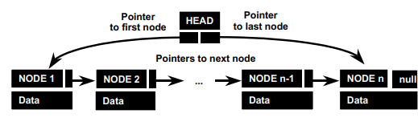
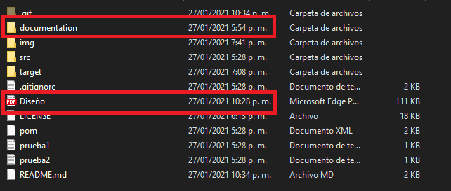
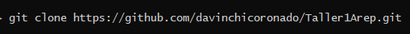
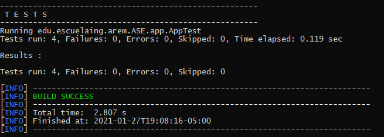

# Escuela Colombiana de Ingeniería Julio Garavito 

## Taller 1 Arquitecturas empresariales - AREP
### INTRODUCTION TO COMPLEX SYSTEMS, JAVA, MVN, AND GIT

### Descripción
La clase app  permite calcular la desviación estandar y el promedio de un
conjunto de datos almacenados en un archivo plano, tambien utiliza una clase linked
list propiamente implementada donde guardara todos estos valores.

La linked list o bien lista enlasada tiene distintas funciones ademas de solo almacenar 
datos y retornarlos, provee distintas funcionalidades propias de esta.

  

Para saber mas acerca de estas clases, podremos ver documentacion mas detallada  en el  siguiente directorio llamado documentation.

  

### Descarga y ejecución

Para poder modificar, ejecutar o usar el proyecto debemos tener las herramientas Maven y Git previamente instaladas.
Para descargar podemos hacerlo directamente en la pagina web de la pagina o utilizando el siguente comando

  

Este es un conjunto de herramientas, asi que podras usarlos en tus proyectos que realices. Para correr las pruebas y 
tener certesa del se deberan ejecutar los siguientes comandos mvn test.

  

### Authors

David Leonardo Coronado Gomez
  
  

