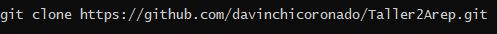

# Escuela Colombiana de Ingeniería Julio Garavito 

## Taller 2 Arquitecturas empresariales - AREP
### INTRODUCTION TO COMPUTER SYSTEM DESIGN

### Descripción
El proyecto Taller 2 Arep permite calcular la  desviación estandar mediante una pagina
web, la cual podemos acceder con el siguiente link:
\
https://sheltered-forest-25930.herokuapp.com/calculate

Para esto utiliza la clase app que ofrece este servicio de calculos, 
la cual recibe un string donde ya bienen todos estos datos, tambien utiliza una clase linked
list propiamente implementada donde guardara todos estos valores.

La linked list o bien lista enlasada tiene distintas funciones ademas de solo almacenar 
datos y retornarlos, provee distintas funcionalidades propias de esta.

  

Para saber mas acerca de estas clases, podremos ver documentacion mas detallada  en el  siguiente directorio llamado documentation y
tambien encontraremos un pdf describiendo el diseño del mismo.

  
  
Para poder realizar estos calculos la pagina web nos ofrece un formulario donde el usuario podra ingresar los datos separados por coma (,).

Luego le damos al boton "submit" y nos mostrara los resultados calculados.

  

### Descarga y ejecución

Para poder modificar, ejecutar o usar el proyecto debemos tener las herramientas Maven,Heroku y Git previamente instaladas.
Para descargar podemos hacerlo directamente en la pagina web de la pagina o utilizando el siguente comando

  

Este es un conjunto de herramientas, asi que podras usarlos en tus proyectos que realices. Para correr las pruebas y 
tener certesa del se deberan ejecutar los siguientes comandos mvn test.

  
  
 Y finalmente para ejecutar con los siguientes comandos:
 
 Para Windows 
 
 
 
 Para sistemas Unix
 
 
 
 Luego de esto abrimos algún navegador con el siguiente link http://localhost:4567/calculate.

### Authors

David Leonardo Coronado Gomez
  
  

